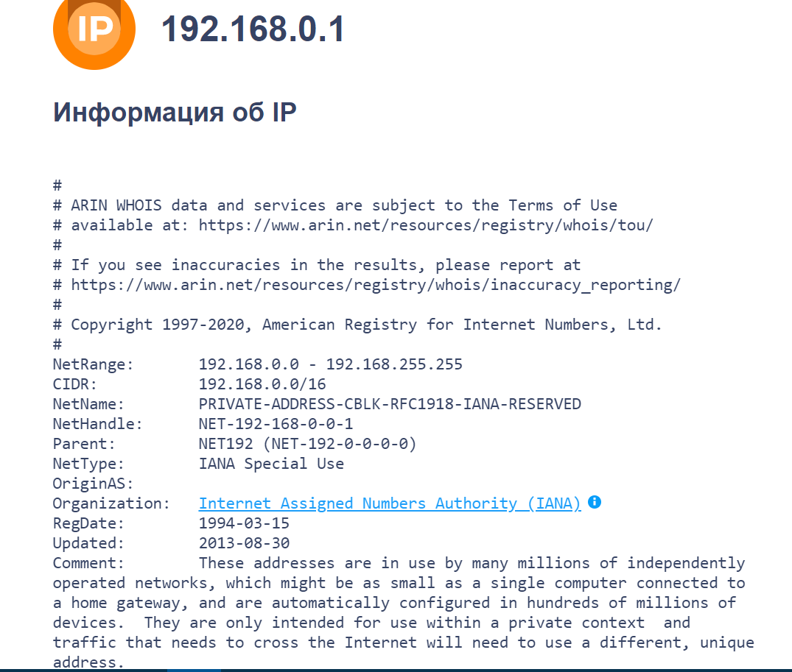
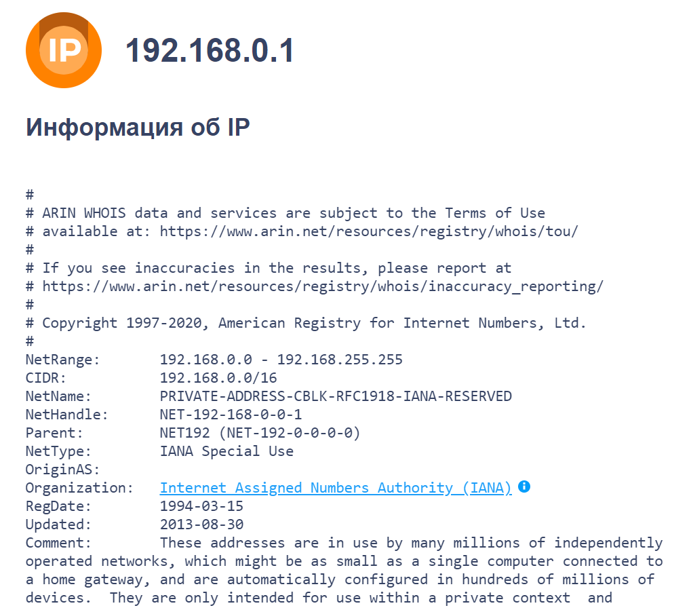

---
output:
  html_document: default
  pdf_document: default
  word_document: default
---
## Исследование сетевых параметров публичных DNS серверов.
### Цель:
Проанализировать сетевые параметры публичных DNS серверов, сделать мотивированный вывод о предпочтительных серверах.   

### Исходные данные:
1.Rstudio IDE    
2.traceroute/tracert    
3.ping    
4.whois    

### Варианты решения задачи:
1. Использование специализированных утилит и сайтов.

### Содержание лабораторной работы:
#### 1.Google Public DNS - 8.8.8.8
Для начала определим доступность адреса.Ping - специальная программа для проверки доступности сетевых ресурсов.

```{r cache=TRUE} 
system("ping 8.8.8.8 ", intern = TRUE)
```
Сервис доступен. Теперь можно начинать делать трассировку. Traceroute — это служебная компьютерная программа, предназначенная для определения маршрутов следования данных в сетях TCP/IP. 
```{r cache=TRUE} 
system("tracert 8.8.8.8", intern = TRUE)
```

Появление символа * означает, что данный узел не откликается. Но по тем узлам, которые откликнулись мы можем определить маршрут.
Но чтобы собрать информацию о местоположении каждого узла маршрута к DNS-серверу и организацию, владеющую каждым узлом маршрута к DNS-серверу восопльзуемся сервисом whois.
  
Теперь соберем информацию в одну таблицу.

| Номер | Время 1 | Время 2 | Время 3 | Средняя задержка | Наивысшая временная задержка при передаче (от 1 до 10) |     IP-адрес    | Местоположение |             Организация             |
|:-----:|:-------:|:-------:|:-------:|:----------------:|:------------------------------------------------------:|:---------------:|:--------------:|:-----------------------------------:|
|   1   |    3    |    6    |    3    |         4        |                            9                           |   192.168.0.1   |   Los Angeles  | Internet Assigned Numbers Authority |
|   2   |    10   |    6    |    11   |         9        |                            8                           |  100.104.208.1  |   Los Angeles  | Internet Assigned Numbers Authority |
|   3   |    16   |    6    |    15   |        12        |                            7                           |  217.107.123.86 |     Moscow     |           ROSTELECOM NETS           |
|   4   |    6    |    6    |    23   |        12        |                            7                           |  87.226.139.180 |     Moscow     |            JSC Rostelecom           |
|   5   |    27   |    26   |    27   |        27        |                            5                           |   72.14.209.89  |  Mountain View |              Google LLC             |
|   6   |    25   |    25   |    25   |        25        |                            6                           | 108.170.250.130 |  Mountain View |              Google LLC             |
|   7   |    43   |    44   |    44   |        44        |                            1                           |  209.85.255.136 |  Mountain View |             Google LLC              |
|   8   |    40   |    41   |    39   |        40        |                            3                           |  209.85.254.20  |  Mountain View |              Google LLC             |
|   9   |    43   |    43   |    43   |        43        |                            2                           |  74.125.253.147 |  Mountain View |              Google LLC             |
|   10  |    38   |    38   |    39   |        38        |                            4                           |     8.8.8.8     |     Monroe     |         Level 3 Parent, LLC         |
 Средняя RTT к DNS-серверу составила - 254 ms.
 
#### 2.Cloudflare DNS - 1.1.1.1
Для начала определим доступность адреса.Ping - специальная программа для проверки доступности сетевых ресурсов.

```{r cache=TRUE} 
system("ping 1.1.1.1 ", intern = TRUE)
```
Сервис доступен. Теперь можно начинать делать трассировку. Traceroute — это служебная компьютерная программа, предназначенная для определения маршрутов следования данных в сетях TCP/IP. 
```{r cache=TRUE} 
system("tracert 1.1.1.1", intern = TRUE)
```
Появление символа * означает, что данный узел не откликается. Но по тем узлам, которые откликнулись мы можем определить маршрут.
Но чтобы собрать информацию о местоположении каждого узла маршрута к DNS-серверу и организацию, владеющую каждым узлом маршрута к DNS-серверу восопльзуемся сервисом whois.
  
Теперь соберем информацию в одну таблицу.

| Номер | Время 1 | Время 2 | Время 3 | Средняя задержка | Наивысшая временная задержка при передаче (от 1 до 11) |     IP-адрес    | Местоположение |                Организация                |
|:-----:|:-------:|:-------:|:-------:|:----------------:|:------------------------------------------------------:|:---------------:|:--------------:|:-----------------------------------------:|
|   1   |    3    |    3    |    3    |         3        |                           11                           |   192.168.0.1   |   Los Angeles  |    Internet Assigned Numbers Authority    |
|   2   |    6    |    8    |    12   |         7        |                            9                           |  100.104.208.1  |   Los Angeles  |    Internet Assigned Numbers Authority    |
|   3   |    6    |    6    |    6    |         6        |                           10                           | 217.107.123.120 |     Moscow     |              ROSTELECOM NETS              |
|   4   |    21   |    7    |    7    |        12        |                            8                           |  87.226.139.182 |     Moscow     |              ROSTELECOM NETS              |
|   5   |    32   |    42   |    45   |        40        |                            7                           |  213.59.212.217 |     Moscow     |              ROSTELECOM NETS              |
|   6   |    73   |    71   |    70   |        71        |                            6                           |  217.161.68.34  |     London     |         AS1273 Customer P2P links         |
|   7   |   568   |   513   |    *    |        540       |                            3                           |    4.68.70.37   |     Monroe     |            Level 3 Parent, LLC            |
|   8   |    *    |   429   |   588   |        509       |                            5                           | 195.122.183.210 |     Germany    |          Level (3) Communications         |
|   9   |   545   |    *    |    *    |        545       |                            2                           |     1.1.1.1     |    Research    | APNIC and Cloudflare DNS Resolver project |
|   10  |    *    |   537   |    *    |        537       |                            4                           |     1.1.1.1     |    Research    | APNIC and Cloudflare DNS Resolver project |
| 11    |    *    |   549   |   578   |        564       |                            1                           |     1.1.1.1     |    Research    | APNIC and Cloudflare DNS Resolver project |

Средняя RTT к DNS-серверу составила - 2834 ms.

#### 3.OpenDNS - 208.67.222.222
Для начала определим доступность адреса.Ping - специальная программа для проверки доступности сетевых ресурсов.

```{r cache=TRUE} 
system("ping 208.67.222.222", intern = TRUE)
```
Сервис доступен. Теперь можно начинать делать трассировку. Traceroute — это служебная компьютерная программа, предназначенная для определения маршрутов следования данных в сетях TCP/IP. 
```{r cache=TRUE} 
system("tracert 208.67.222.222", intern = TRUE)
```
По тем узлам, которые откликнулись мы можем определить маршрут.
Но чтобы собрать информацию о местоположении каждого узла маршрута к DNS-серверу и организацию, владеющую каждым узлом маршрута к DNS-серверу восопльзуемся сервисом whois.
  
Теперь соберем информацию в одну таблицу.

| Номер | Время 1 | Время 2 | Время 3 | Средняя задержка | Наивысшая временная задержка при передаче (от 1 до 9) |     IP-адрес    | Местоположение |             Организация             |
|:-----:|:-------:|:-------:|:-------:|:----------------:|:-----------------------------------------------------:|:---------------:|:--------------:|:-----------------------------------:|
|   1   |    3    |    3    |    3    |         3        |                           9                           |   192.168.0.1   |   Los Angeles  | Internet Assigned Numbers Authority |
|   2   |    7    |    6    |    7    |         7        |                           7                           |  100.104.208.1  |   Los Angeles  | Internet Assigned Numbers Authority |
|   3   |    23   |    15   |    5    |        14        |                           6                           |  217.107.123.86 |     Moscow     |           ROSTELECOM NETS           |
|   4   |    5    |    8    |    6    |         6        |                           8                           |  87.226.139.180 |     Moscow     |           ROSTELECOM NETS           |
|   5   |    45   |    44   |    44   |        44        |                           4                           |  87.226.133.51  |     Moscow     |           ROSTELECOM NETS           |
|   6   |    40   |    41   |    40   |        40        |                           5                           |   77.67.90.96   |     Germany    |     Tinet International Network     |
|   7   |   255   |   252   |   253   |        253       |                           1                           | 213.200.117.202 |     Germany    |                 GTT                 |
|   8   |    65   |    64   |    65   |        65        |                           3                           |   77.67.66.70   |     Germany    |  Tiscali International Network B.V. |
|   9   |   246   |   244   |   237   |        242       |                           2                           |  208.67.222.222 |  San Francisco |          Cisco OpenDNS, LLC         |

Средняя RTT к DNS-серверу составила - 674 ms.

#### 4.DNS провайдера - 192.168.0.1
Для начала определим доступность адреса.Ping - специальная программа для проверки доступности сетевых ресурсов.

```{r cache=TRUE} 
system("ping 192.168.0.1", intern = TRUE)
```
Сервис доступен. Теперь можно начинать делать трассировку. Traceroute — это служебная компьютерная программа, предназначенная для определения маршрутов следования данных в сетях TCP/IP. 
```{r cache=TRUE} 
system("tracert 192.168.0.1", intern = TRUE)
```
По тем узлам, которые откликнулись мы можем определить маршрут.
Но чтобы собрать информацию о местоположении каждого узла маршрута к DNS-серверу и организацию, владеющую каждым узлом маршрута к DNS-серверу восопльзуемся сервисом whois.
  
Теперь соберем информацию в одну таблицу.

| Номер | Время 1 | Время 2 | Время 3 | Средняя задержка |   IP-адрес  | Местоположение |             Организация             |
|:-----:|:-------:|:-------:|:-------:|:----------------:|:-----------:|:--------------:|:-----------------------------------:|
|   1   |   166   |   203   |    97   |        155       | 192.168.0.1 |   Los Angeles  | Internet Assigned Numbers Authority |

Средняя RTT к DNS-серверу составила - 155 ms.

#### 5.Осталось сравнить сетевые параметры DNS серверов.

```{r cache=TRUE} 
time <- c(254, 2834, 674, 155)
name <- c("Google Public DNS", "Cloudflare",  "Open DNS", "DNS провайдера")

DNS <- data.frame(Name= name, Time = time)

barplot(DNS$Time, names.arg = DNS$Name, col = "olivedrab3")
```

### Оценка результата.
Из сравнительной диаграммы видно, что наибольшая временная задержка при передаче возникла у Cloudflare DNS, а меньше всего времени потребовалось DNS провайдеру.

### Вывод.
В данной лабораторной работе, мы исследовали сетевы параметры публичных DNS серверов.Обычно, на пути прохождения запросов встречается кэширующий сервер, который хранит необходимую информацию в кэше. Каким образом локальный DNS сервер, получивший рекурсивный запрос от резолвера, выбирает DNS-сервер из списка авторитативных? Существует множество корневых DNS-серверов в сети Интернет, какому из корневых серверов наш DNS-сервер отправит запрос? Для решения данного вопроса DNS-серверы BIND используют метрику, называемую временем отклика (roundtrip time, или RTT), для выбора среди авторитативных DNS-серверов одной зоны. RTT определяет задержку, с которой приходит ответ на запросы от удаленного сервера. Каждый раз, при передаче запроса удаленному серверу, DNS-сервер BIND запускает внутренний таймер. Таймер останавливается при получении ответа, и метрика фиксируется локальным сервером. Если приходится выбирать один из нескольких авторитативных серверов, выбор падает на сервер с наименьшим показателем RTT.


